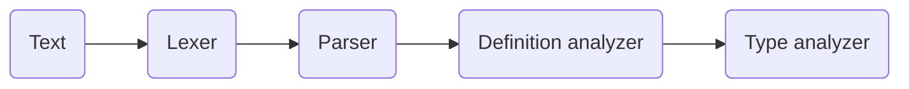

# Gota

## Overview

**gota (go-tee-a)** is a GO Template Analyzer. It parses **go template** file and produces a parse tree on which operations can be executed on.
More than anything, it is primarily developed as a main component for the *go template LSP* from the same author.

This parser in particular make a **syntactical & semantical** parsing. 
On one hand, the syntax parsing is made with a standard lexer and parser, at the end of which a *parse tree* is obtained.
On the other hand, the semantical analysis uses the parse tree to validate the meaning of the language (go template). To achieve this, the semantical analyzer consists of 2 components:

- **Definition analyzer**: traverse the parse tree in order to check that all *variables, functions, and templates* used in the project are defined
- **Type analyzer**: traverse the parse tree in order to validate that there is no type mismatch between functions and variables, templates and variables

Thus the processing order could be summed up as :


This is especially meaningful since any statements with error encountered in an earlier stage will not be passed to the next stage.

Put on another word, statement error found during 'lexing' won't be passed to the 'parser'.
For instance, this go template statement `{{ if -true }}` won't survive the lexing because (`-`) is an unrecognized symbol. The lexer will output an error, as well ass returns a list of valid tokens that didn't encounter any error. Only that valid list will be handed to the parser.

NB: In this text, *parsing* and *analysis* are used interchangeably

## Install

```bash
go get github.com/yayolande/gota
```

## Usage

Take a look at the `./examples` directory to have a feel for it.
For debugging purpose, there is a `gota.Print()` function that convert the tree into a JSON string and print it to the screen. Use the `jq` program for pretty formatting

## Docs

## Quick-start

## Roadmap

- [x] Lexer 
- [x] Syntax parser
- [x] Definition Analysis (operation)
- [ ] Type Analysis (operation on parse tree)
- [ ] Find declaration of a variable and function
- [ ] Get all symbol starting with specific string
- [ ] Type hint analysis on comment (helpful to enforce type on lsp)
- [ ] Add more examples and more docs to 'readme'

